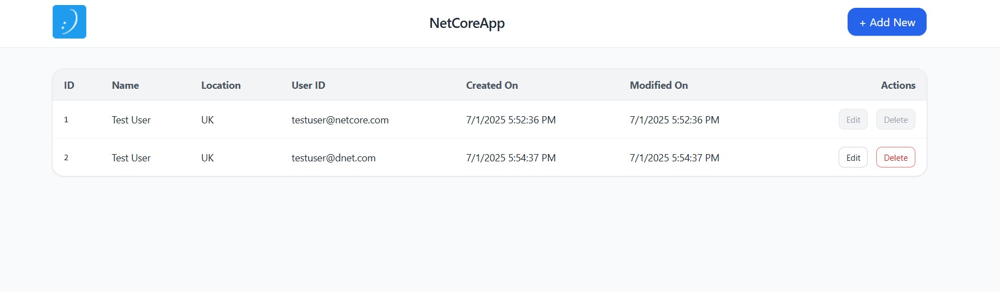
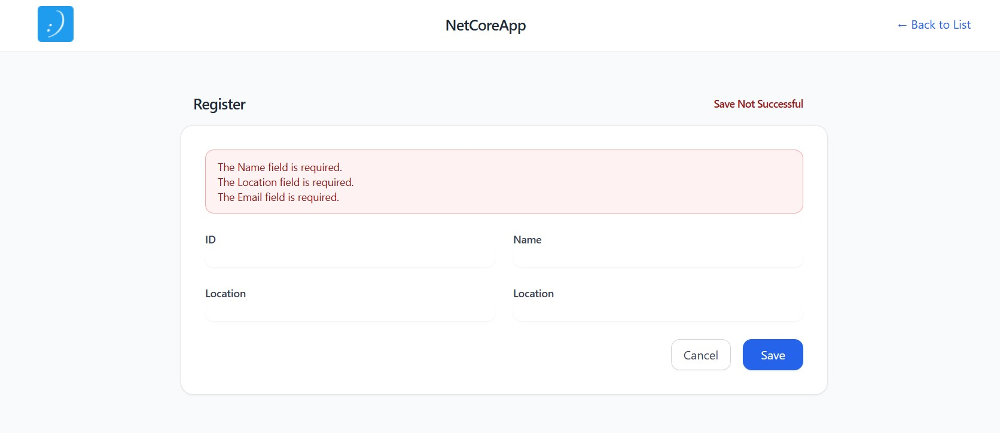
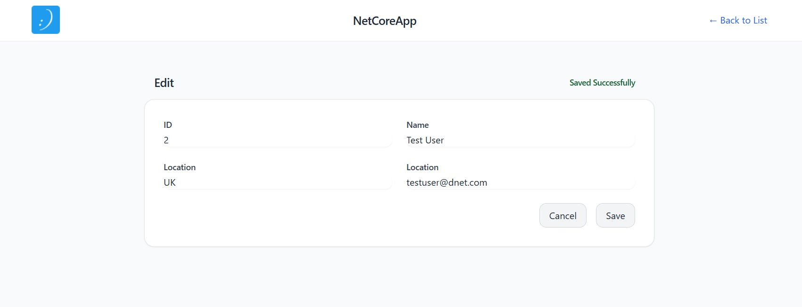

# 🏷️ Tag Helpers

- Use Tag Helpers for cleaner, smarter markup that compiles safely and scales with your UI.
- They're the Razor dev’s power tool — elegant, readable, and extensible.

---

## 🖼️ Screen Shots

Search


Create


Read


---

## 🚀 Why Use Tag Helpers?

| ✅ Benefit              | 🧠 What It Means                                                  |
|------------------------|------------------------------------------------------------------|
| HTML-like syntax       | Razor markup remains readable to frontend developers             |
| Compile-time safety     | Errors like controller/action typos are caught at build time     |
| Automatic anti-forgery  | `<form>` injects hidden anti-forgery token automatically         |
| Clean attribute mixing  | Combine `asp-*` attributes with Tailwind/Bootstrap classes       |
| Extensible              | Create your own reusable helpers for buttons, links, etc.        |

---

## 🛠️ Setup: Import Tag Helpers

Add the following to `/Views/_ViewImports.cshtml` (once):

```razor
@addTagHelper *, Microsoft.AspNetCore.Mvc.TagHelpers
```

---

## 📦 Built-in Tag Helpers

|💡 Tag Helper		|🔧 Markup Example															|🔄 Replaces Razor Helper		|
|-------------------|---------------------------------------------------------------------------|-------------------------------|
|Anchor <a>			|<a asp-controller="Users" asp-action="Edit" asp-route-id="@u.Id">Edit</a>	|@Html.ActionLink()				|
|Form <form>		|<form asp-action="Save" method="post"> (anti-forgery token auto-injected)	|@using (Html.BeginForm())		|
|Input <input>		|<input asp-for="Email" class="form-input" />								|@Html.TextBoxFor()				|
|Label <label>		|<label asp-for="Name">Full Name</label>									|@Html.LabelFor()				|
|Validation <span>	|<span asp-validation-for="Email" class="text-red-600 text-sm"></span>		|@Html.ValidationMessageFor()	|
|Cache busting		|<link rel="stylesheet" href="~/css/site.css" asp-append-version="true" />	|Manual query string			|

📝 Note: ValidationSummary has no Tag Helper — still use @Html.ValidationSummary() or wrap in a partial.

---

## 🧩 Form Example

```
<form asp-action="Register" method="post" class="space-y-6">
  <div>
    <label asp-for="FullName" class="block text-sm font-medium text-gray-700"></label>
    <input asp-for="FullName" class="mt-1 block w-full rounded-md border-gray-300" />
    <span asp-validation-for="FullName" class="text-red-600 text-xs" />
  </div>

  <div>
    <label asp-for="Email" class="block text-sm font-medium text-gray-700"></label>
    <input asp-for="Email" type="email" class="mt-1 block w-full rounded-md border-gray-300" />
    <span asp-validation-for="Email" class="text-red-600 text-xs" />
  </div>

  <button type="submit" class="btn-primary">Register</button>
</form>
```
---

## 🧠 Pro Tips

- asp-controller, asp-action, asp-route-id auto-generate correct links
- asp-for="Property" binds tag to Model.Property
- asp-append-version="true" appends a cache-busting hash to file URLs
- Combine freely with class, type, id, placeholder, etc.

---

## Custom Tag Helper

csharp:
```
public class PrimaryButtonTagHelper : TagHelper
{
    public override void Process(TagHelperContext context, TagHelperOutput output)
    {
        output.TagName = "button";
        output.Attributes.SetAttribute("class", "btn btn-primary");
    }
}
```

view - razor:
```
<primary-button>Save</primary-button>
```

_ViewImports.cshtml:
```
@addTagHelper *, YourAppNamespace
```

----

## Common Issues -> Fix

| ❌ Issue                        | ✅ Fix                                                          |
| ------------------------------ | -------------------------------------------------------------- |
| Static files don’t update      | Ensure they’re in `/wwwroot/` and `UseStaticFiles()` is called |
| Tag Helper doesn’t show effect | Check import in `_ViewImports.cshtml`                          |
| `asp-route-id` doesn’t bind    | Ensure route token name in controller matches exactly          |
