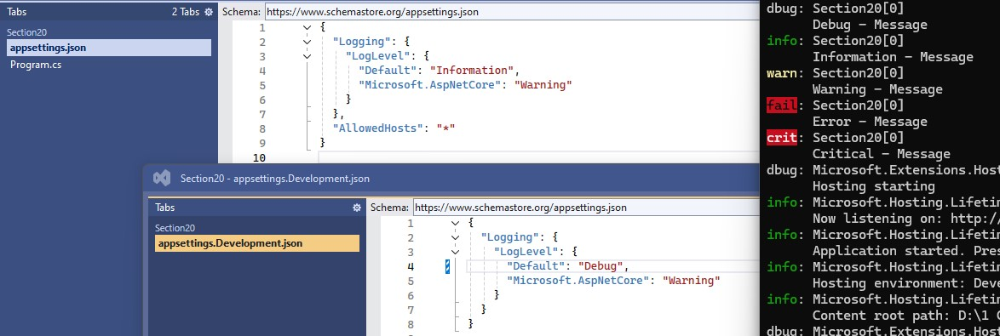
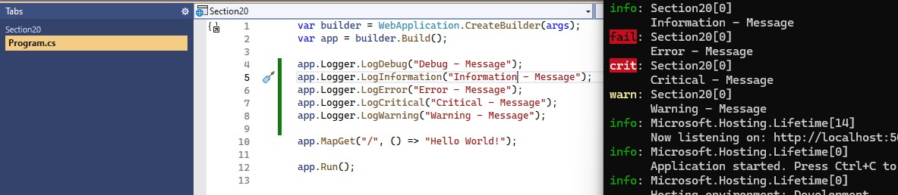
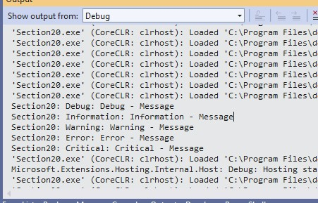
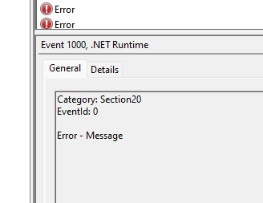
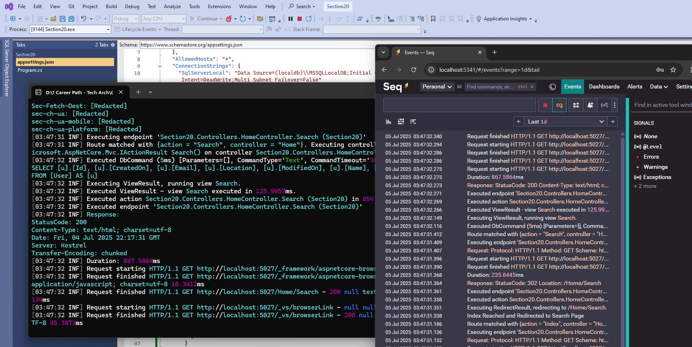
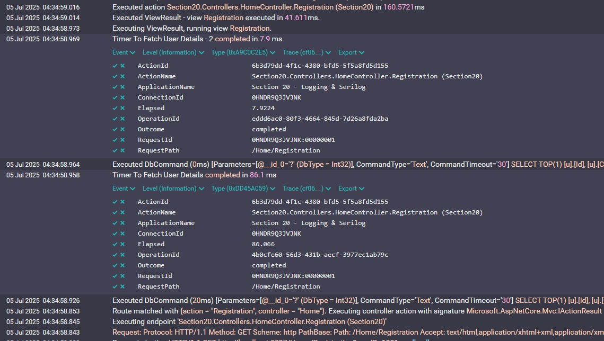

# Section 20 – Logging & Serilog (ASP.NET Core)

## 📚 What This Section Covers

This module introduces **logging fundamentals in ASP.NET Core**, focusing on both the **built-in logging system** and **advanced logging using Serilog**. 

This Section covers:

- How to enable and configure logging providers in .NET Core
- Using `HttpLoggingMiddleware` to log request and response metadata
- Adding `Serilog` as a structured logging framework
- Configuring various Serilog sinks: Console, File, SQL Server, Seq
- Managing log levels, formats, and rotation
- Using `appsettings.json` to drive logging configuration
- Handling real-time logging diagnostics and common runtime issues
- Logging EF Core performance timings with Serilog

---

## 🔑 Key Points

- **Logging is critical** for monitoring, debugging, auditing, and performance profiling in modern applications.

- **ASP.NET Core provides built-in logging abstraction** (`ILogger`) which is extensible and supports multiple providers (Console, Debug, EventLog, Azure, etc.).

- **Structured Logging** (e.g., via Serilog) allows logs to be emitted as key-value pairs, enabling powerful filtering and searching in log aggregators.

- **Logging Providers** define *where* logs go:  
  - **Console / Debug** – local development  
  - **File** – persistent storage  
  - **Database (e.g., MSSQL)** – for audit/history  
  - **Seq / Kibana / Splunk / Application Insights** – real-time dashboards

- **Log Levels** help control verbosity:  
  - `Trace` > `Debug` > `Information` > `Warning` > `Error` > `Critical`

- **Log Enrichers** add useful metadata (e.g., `RequestId`, `UserId`, `Environment`).

- **Serilog** is one of the most popular .NET logging libraries due to:
  - Easy JSON-based configuration
  - Rich ecosystem of **sinks**
  - Native support for **structured logging**
  - Strong integration with .NET’s `ILogger<T>`

- **Post-Redirect-Get Pattern** + `TempData` can help display success/failure messages after an action is complete.

- **Performance Logging** is critical for measuring latency in DB, API, and user operations. Use `SerilogTimings`, `Stopwatch`, or Application Performance Monitoring (APM) tools.

- **Best Practices**:
  - Don’t log sensitive info (e.g., passwords, tokens)
  - Avoid overly verbose logging in production
  - Centralize logs for distributed systems
  - Use correlation IDs to trace requests across services
  - Implement retention policies (delete old logs)

- **Common Pitfalls**:
  - Logging too much in high-load apps → performance hit
  - Missing log context (e.g., user/session data)
  - Not handling log storage limits (especially with file sinks)

---

### Screen Shots

Debug Level Config



Console



Debug



Event Viewer



Serilog Seq



Serilog Timings



---

## 1. Built‑in Logging

```csharp
// Program.cs
builder.Logging.ClearProviders()          // remove Debug & EventSource
               .AddConsole();            // enable Console provider

builder.Services.AddHttpLogging(opts =>
{
    // minimal request logging (path, method, status)
    opts.LoggingFields = HttpLoggingFields.RequestPath |
                         HttpLoggingFields.RequestMethod |
                         HttpLoggingFields.ResponseStatusCode;
});

app.UseHttpLogging();                    // middleware
```
---
## 2. Sering Integration

```
using Serilog;

builder.Host.UseSerilog((HostBuilderContext context, IServiceProvider services, LoggerConfiguration loggerConfiguration) =>
{
    loggerConfiguration.ReadFrom.Configuration(context.Configuration)   //Reads static settings from appsettings.json, appsettings.Development.json, environment variables, etc.
    .ReadFrom.Services(services);   //Pulls runtime‑registered services (e.g., IHttpContextAccessor, custom enrichers, or DI‑configured sinks) into the Serilog pipeline.
});
```

- appsettings.json snippet

```
"Serilog": {
  "MinimumLevel": "Information",
  "Using": [
    "Serilog.Sinks.Console",
    "Serilog.Sinks.File",
    "Serilog.Sinks.MSSqlServer",
    "Serilog.Sinks.Seq"
  ],
  "WriteTo": [
    { "Name": "Console" },
    {
      "Name": "File",
      "Args": {
        "path": "logs/log.txt",
        "rollingInterval": "Hour",
        "fileSizeLimitBytes": 1048576,
        "rollOnFileSizeLimit": true
      }
    },
    {
      "Name": "MSSqlServer",
      "Args": {
        "connectionString": "Server=(localdb)\\MSSQLLocalDB;Database=SerilogLogs;Trusted_Connection=True;",
        "tableName": "Logs",
        "autoCreateSqlTable": true
      }
    },
    { "Name": "Seq", "Args": { "serverUrl": "http://localhost:5341" } }
  ],
  "Enrich": [ "FromLogContext" ],
  "Properties": { "ApplicationName": "Section 20 – Logging & Serilog" }
}
```

- Performance Profiling

```
using (SerilogTimings.Operation.Time("Get user by Id"))
{
    var user = _db.Users.Find(1);
}
```
