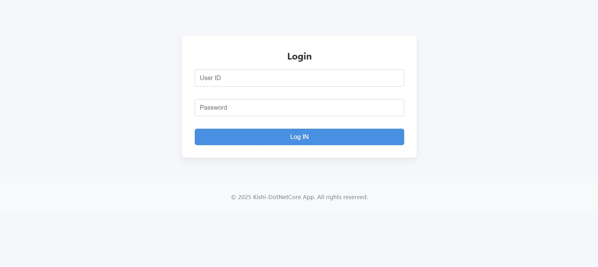
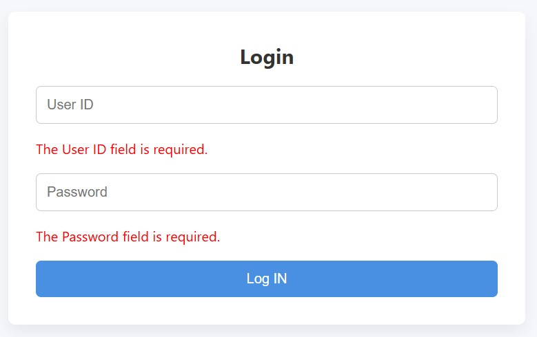
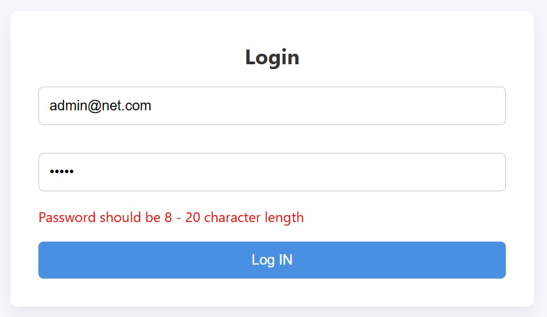
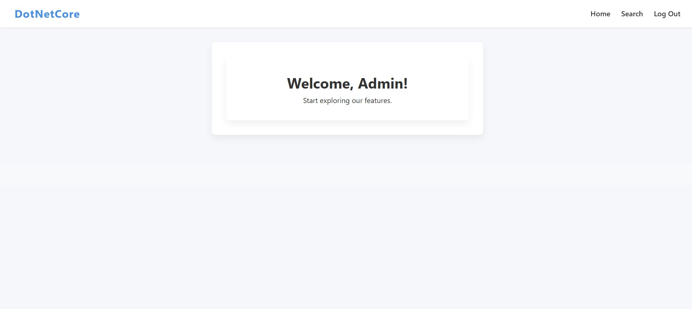
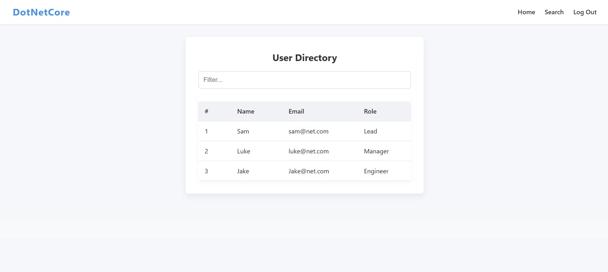

## 🚀 Project Overview

This solution demonstrates essential ASP.NET Core MVC concepts related to **views and layouts**, including:

- Creating and managing **views**
- Using **multiple views** per controller
- Passing data between controllers and views using **ViewData** and **ViewBag**
- Structuring views with **\_ViewStart** and **\_ViewImports**
- Implementing **dynamic layouts**: selecting layouts conditionally per request
- Applying partial views and rendering sections

---

## 🎯 Features

- **Login Page** with client/server-side **validations**  
  
  
  

- Upon successful login, user lands on a **Launch Screen (Home)**  
  

- From Launch Screen, users can navigate to:  
  - **Home (Launch Page)**  
  - **Search Page** featuring a basic data grid (no business logic yet)  
  

- **Logout** functionality to securely exit the application

---

## 🏗️ Architecture Highlights

### Layout Management

- The `_ViewStart.cshtml` file defines the **default layout** for all views.
- Views can override the layout dynamically based on conditions (e.g., user roles, page type).
- `_ViewImports.cshtml` is used to include shared namespaces and tag helpers globally in views.

### Conditional Rendering

- The **footer** section is rendered **only on the Login Page** using Razor's `@RenderSection` with `required: false`.
- This approach keeps page-specific content modular and reusable without cluttering all views.

---

## 📚 Topics Covered

### Creating a View

- Razor syntax and strongly typed views
- Passing models and rendering form controls with helpers

### Multiple Views

- Returning different views from the same controller action based on logic
- Partial views to encapsulate reusable UI components

### View Data & View Bag

- Passing dynamic data using `ViewData["Key"]` and `ViewBag.Property`
- Differences, use cases, and best practices

### \_ViewStart

- Centralized layout definition to avoid repetition
- How it cascades down to all views in a folder structure

### \_ViewImports

- Managing namespaces and tag helpers globally
- Cleaner view files without repetitive `@using` statements

### Dynamic Layout Views

- Using conditional logic in `_ViewStart` or individual views to apply different layouts
- Enhancing UX by varying UI structure per user or page context

---

## 📝 How to Run

1. Clone the repo
2. Build and run the solution in Visual Studio or via CLI:  
   ```bash
   dotnet build
   dotnet run
